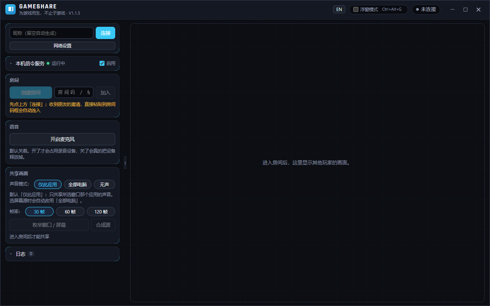
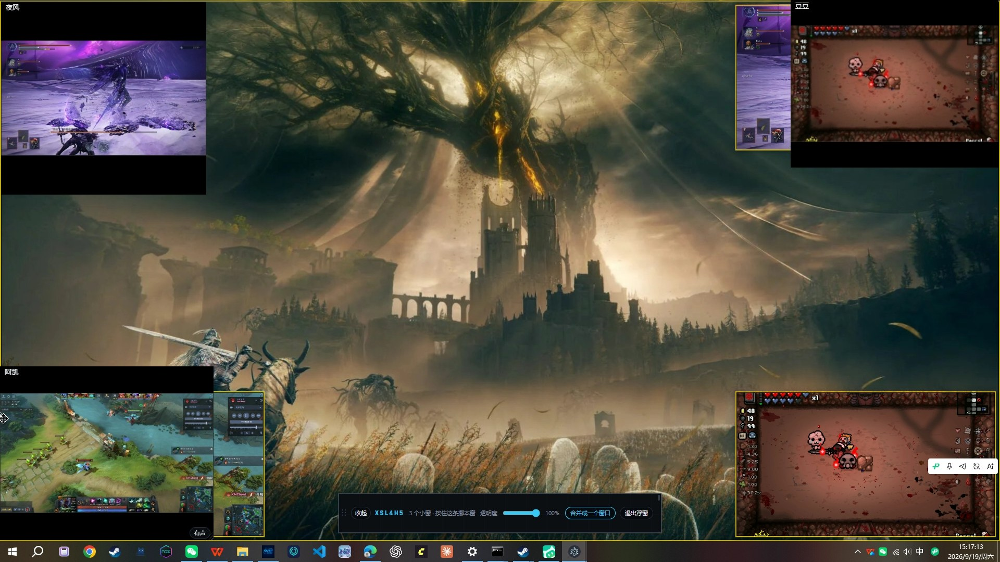

# GameShare

> English | [简体中文](README.md)

> **Built for games, and beyond.**
> Play with friends a thousand miles away — and it feels like they're sitting
> right next to you.





A few friends, each in their own home, each playing their own game — and
everyone can see what everyone else is playing. That's the whole idea.

Open a room, send the invite, your friend pastes it and is in. Then everyone
picks their game window and starts sharing: you see each other's screens, talk
over voice chat, and hear each other's games. 2 to 4 players, video goes over
direct WebRTC connections — no relay server in between.

Current version: v1.2.0. The roadmap (including a few things that deliberately
won't be built) lives in `docs/ROADMAP.md`.

## Features

- **One-paste invites**: the host clicks "copy invite"; the friend pastes the
  whole message into the room code box — address, connection and joining all
  happen automatically. Nothing to type
- **Window sharing**: a thumbnail list of windows, click to share. Exclusive
  fullscreen can't be captured (a Windows limitation); if a game doesn't offer
  borderless windowed mode, the "borderless" button in the list converts it for
  you — click again to restore
- **Three audio modes**: only the shared app's audio (captured per process, so
  notification pings stay out) / the whole PC minus GameShare itself / silence.
  Switchable before or during sharing
- **Per-peer volume control**: each friend's voice and game audio have separate
  sliders, affecting only what you hear
- **Float overlay**: `Ctrl+Alt+G` collapses the streams into a mini window
  above your fullscreen game — no focus stealing, draggable, opacity
  adjustable, and each stream can be split into its own tile
- **Double-click to enlarge**: one stream fills the stage, the rest collapse
  into a thumbnail strip, and quality rebalances automatically
- **Selectable frame rate** (30 / 60 / 120) with bitrate that adapts to the
  content — 2K and ultrawide captures don't get crushed to low quality
- **English / Chinese UI**, one click in the title bar, remembered across restarts

## Read this before you use it: security

This tool has no accounts and no authentication: whether a stranger can join
depends entirely on whether the room code leaks. So —

1. **Never share the tunnel address anywhere public.** The `https://*.trycloudflare.com`
   address from the "remote access" switch is a public entrance to your home
   network. Send it in a private chat to the people you're playing with — not
   in a group, not on a forum, not on any web page. The room code is six
   characters, about a billion combinations, and the server does not
   rate-limit. If the address leaks, someone has all the time in the world to
   try them.
2. **Same for the room code — private chat only.** Anyone who guesses it
   immediately sees your shared screen. There is no confirmation prompt and no
   kick button.
3. **Close the tunnel when you're done.** The shorter it's up, the smaller the
   window. The switch is off by default — keep it that way.
4. **Want to serve strangers? Add authentication first.** The current design
   assumes a small group that trusts each other. The signaling server is a
   plain Node service, and modifying it is straightforward.

LAN addresses (`192.168.x.x`) only work inside your own network — low risk,
but still for your group only.

## Quick start

Both machines only need the installed client — no Node.js, no command line.

**On first launch, Windows Firewall asks for permission — click "Allow".**
Clicking "Cancel" makes the other side hang on "connecting" with no error on
either end. This is the most common first-day stumble.

### Same LAN

1. The host opens GameShare, enables the **built-in signaling server** in the
   sidebar panel, then clicks **create room**;
2. Click **copy invite** next to the room code and send the text to your friend
   (WeChat, QQ, anything);
3. Your friend pastes the whole message into the **room code box** — the
   address fills in, the client connects and joins automatically. Want a
   custom nickname? Type it before pasting.

> If both clients run on the same machine, the first one takes port 8080 and
> the second shows "port in use" — that's fine, it still works as a client.
> The old manual flow (typing the address by hand) lives in the
> "network settings" fold.

### Across networks (remote)

The host turns on the "remote access" switch and waits for the client to start
the tunnel on its own (the packaged build ships with `cloudflared.exe`; only
source mode needs `tools/cloudflared.exe`, see `docs/REMOTE-TESTING.md`).
Then it's the same: create room → copy invite → send it over. Your friend
pastes it and is in. **Turn the switch off when you're done.**

### Sharing a window with sound

In the room, click "enumerate windows / screens" and pick a window from the
list. Audio has three modes:

| Mode | What it does |
| --- | --- |
| **This app only** (default for windows) | Sends only that app's audio (including child processes) — notification pings stay out. Not available for full-screen sources |
| **Whole PC** | Sends all system output except GameShare itself. Echo suppression is limited; headphones are still a good idea |
| **Silent** | Video only |

If system audio can't be captured, it won't quietly pick another mode: the
video keeps going and you get a prompt with three choices (switch to whole-PC
/ continue silent / cancel sharing).

Each remote tile has a volume button — voice and game audio adjust separately.
Two badges on the tile show whether the other side is sending each track right now.

### Watching

Double-click a stream to fill the stage; the rest collapse into a thumbnail
strip. Double-click again or press `Esc` to go back. The enlarged stream gets
more quality, the others step down to save upload.

### The float overlay (for fullscreen games)

Press `Ctrl+Alt+G`: the shared streams collapse into a mini window above your
game — no focus stealing, draggable, opacity adjustable, and each stream can
become its own tile. The game needs to be in **borderless windowed** mode —
exclusive fullscreen can't be captured or overlaid, and that's a Windows
limitation.

## Building from source

Requirements: **Node.js ≥ 20**, Windows 10 / 11.

```bash
npm install            # install all workspace dependencies
npm run dev:desktop    # run the client (Vite + Electron, hot reload)
```

If you'd rather not open a terminal, double-click the bat files in the repo root:

| File | What it does |
| --- | --- |
| `run.bat` | Launch the latest packaged build (no build, no install) |
| `dev.bat` | Run from source (Vite dev server + Electron) |
| `build-exe.bat` | One-click packaging, about 40 seconds, prints the output path |
| `diagnose-capture.bat` | Diagnose "the window is running but not in the capture list" |
| `tunnel.bat` | Manually start the remote tunnel (the client already has a switch) |

Build output lands in `apps/desktop/release/`: `GameShare Setup 1.2.0.exe`
(installer) or `win-unpacked/GameShare.exe` (portable).

> The bat files look for node.exe via the `GAMESHARE_NODE_DIR` environment
> variable, then PATH. Machine-specific build pitfalls are documented in
> `docs/BUILD-NOTES.md`.

## The test suite

Every feature ships with scripts that judge pass/fail on their own:

```bash
npm run smoke              # signaling: 17 cases (rooms, limits, forgery, cleanup, heartbeat)
npm run smoke:p2p          # link layer: real Electron windows, asserts decoded frames keep rising
npm run check:app-audio    # app audio: real windows, real test tones, FFT isolation measurement (67 checks)
npm run check:media-tracks # 3-track media structure + digital feedback loop: 4-window model, two rounds
npm run check:embedded     # embedded signaling server, verified against the packaged build
npm run check:standalone   # standalone deployment artifact: zero-dependency boot, dual-stack
npm run check:topmost      # overlay z-order and focus (22 checks)
npm run check:tiles        # overlay split mode (117 checks, 8 groups)
npm run check:network      # local P2P capability diagnosis (public IPv6 / NAT type)
npm run check:stun         # STUN node health (can Chromium get srflx here)
```

A few principles behind them: assertions compare actual values against
protocol-derived expectations; key criteria have a control group (turn the
audio back on and it must be audible again, otherwise your meter is deaf);
important assertions have been verified to fail when they should. `smoke:p2p`
covers synthetic sources; real system audio is `check:app-audio`'s job.
Whether a real game window carries its real sound can only be checked by ear.

## Documentation

| If you want to | Read |
| --- | --- |
| Understand the project and run it | This file |
| Change code: what to read, what to run, what bites | `docs/CONVENTIONS.md` |
| Why a constraint exists | `docs/ARCHITECTURE.md` §4 |
| Roadmap, milestones, and deliberate non-goals | `docs/ROADMAP.md` |
| Cross-network testing and diagnosis (NAT / tunnel / IPv6) | `docs/REMOTE-TESTING.md` |
| Machine-specific build pitfalls | `docs/BUILD-NOTES.md` |
| Contributing | `CONTRIBUTING.md` |

## Known limitations

1. Exclusive fullscreen can't be captured (Windows limitation) — use borderless
   windowed. If the game doesn't offer it, the "borderless" button in the
   source list converts the window (click again to restore). It only calls
   Win32 window APIs and never touches the game process, but a few games
   re-apply their own window style and defeat it;
2. Symmetric NAT can't connect and there's no TURN fallback (that's M8);
3. No authentication — see the security section;
4. Kernel-level anti-cheat systems (EAC / BattlEye / Vanguard) may treat screen
   capture specially. Use at your own risk; try a game without anti-cheat first;
5. Windows-only for system audio capture (per-app / whole-PC both rely on
   Windows process-tree loopback).

## Contributing

Issues, forks, and PRs are welcome. Read `docs/CONVENTIONS.md` first — it maps
each kind of change to required reading, required checks, and the mistakes
already made for you. New features come with acceptance scripts; bug fixes come
with an assertion that fails before the fix.

## License

[MIT](LICENSE)

---

## Disclaimer

This software is provided "as is", without warranty of any kind. It transmits
your screen and audio to other people in the room — use it only with people you
know and trust. The signaling link has no authentication or access control;
managing public addresses and room codes is your responsibility. Do not use
this software for anything that violates your local laws.
