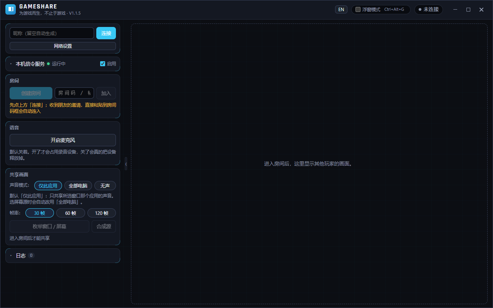
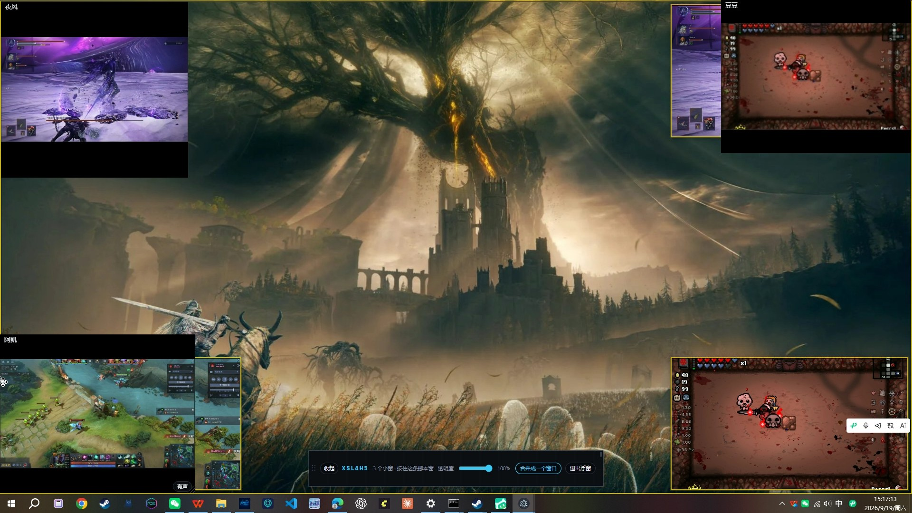
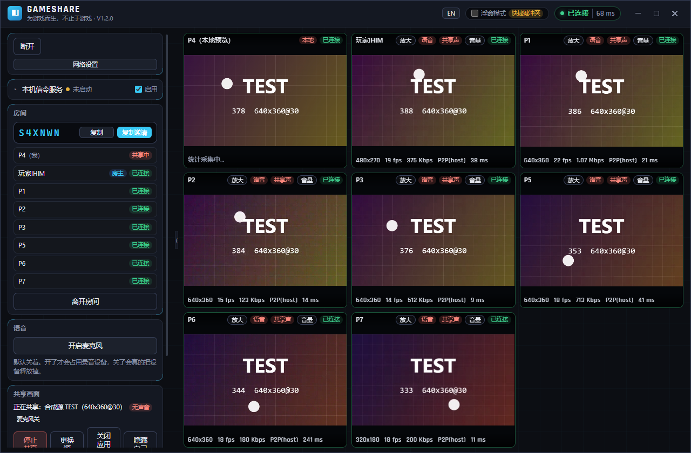

# GameShare

> English | [简体中文](README.md)

> **Built for games, and beyond.**
> Play with friends a thousand miles away — and it feels like they're sitting
> right next to you.







A few friends, each in their own home, each playing their own game — and
everyone can see what everyone else is playing. That's the whole idea.

Open a room, send the invite, your friend pastes it and is in. Then everyone
picks their game window and starts sharing: you see each other's screens, talk
over voice chat, and hear each other's games. 2 to 8 players, video goes over
direct WebRTC connections; an optional TURN relay covers the networks where
hole punching can't work (see below). 8 is the architecture
headroom for mesh: with N players everyone uploads N-1 streams (8 players ≈
42 Mbps up + 7 hardware encodes per machine), so how many of you can actually
play depends on your upload bandwidth. The screenshot above is a local
full-room test with synthetic sources: all 7 remote streams decoded, frames
flowing — the UI and the connections hold up; the only variable left is the
real network.

Current version: v1.3.0. The roadmap (including a few things that deliberately
won't be built) lives in `docs/ROADMAP.md`.

## Features

- **One-paste invites**: the host clicks "copy invite"; the friend pastes the
  whole message into the room code box — address, connection and joining all
  happen automatically. Nothing to type
- **Window sharing**: a thumbnail list of windows, click to share. Exclusive
  fullscreen can't be captured (a Windows limitation); if a game doesn't offer
  borderless windowed mode, the "borderless" button in the list converts it for
  you — click again to restore
- **Three audio modes**: only the shared app's audio (captured per process, so
  notification pings stay out) / the whole PC minus GameShare itself / silence.
  Switchable before or during sharing
- **Per-peer volume control**: each friend's voice and game audio have separate
  sliders, affecting only what you hear
- **Float overlay**: `Ctrl+Alt+G` collapses the streams into a mini window
  above your fullscreen game — no focus stealing, draggable, opacity
  adjustable, and each stream can be split into its own tile
- **Double-click to enlarge**: one stream fills the stage, the rest collapse
  into a thumbnail strip, and quality rebalances automatically
- **Selectable frame rate** (30 / 60 / 120) with bitrate that adapts to the
  content — 2K and ultrawide captures don't get crushed to low quality
- **English / Chinese UI**, one click in the title bar, remembered across restarts

## Read this before you use it: security

This tool has no accounts and no authentication: whether a stranger can join
depends entirely on whether the room code leaks. So —

1. **Never share the tunnel address anywhere public.** The `https://*.trycloudflare.com`
   address from the "remote access" switch is a public entrance to your home
   network. Send it in a private chat to the people you're playing with — not
   in a group, not on a forum, not on any web page. The room code is six
   characters, about a billion combinations, and the server does not
   rate-limit. If the address leaks, someone has all the time in the world to
   try them.
2. **Same for the room code — private chat only.** Anyone who guesses it
   immediately sees your shared screen. There is no confirmation prompt and no
   kick button.
3. **Close the tunnel when you're done.** The shorter it's up, the smaller the
   window. The switch is off by default — keep it that way.
4. **Want to serve strangers? Add authentication first.** The current design
   assumes a small group that trusts each other. The signaling server is a
   plain Node service, and modifying it is straightforward.

LAN addresses (`192.168.x.x`) only work inside your own network — low risk,
but still for your group only.

## Quick start

Both machines only need the installed client — no Node.js, no command line.

**On first launch, Windows Firewall asks for permission — click "Allow".**
Clicking "Cancel" makes the other side hang on "connecting" with no error on
either end. This is the most common first-day stumble.

### Same LAN

1. The host opens GameShare, enables the **built-in signaling server** in the
   sidebar panel, then clicks **create room**;
2. Click **copy invite** next to the room code and send the text to your friend
   (WeChat, QQ, anything);
3. Your friend pastes the whole message into the **room code box** — the
   address fills in, the client connects and joins automatically. Want a
   custom nickname? Type it before pasting.

> If both clients run on the same machine, the first one takes port 8080 and
> the second shows "port in use" — that's fine, it still works as a client.
> The old manual flow (typing the address by hand) lives in the
> "network settings" fold.

### Across networks (remote)

The host turns on the "remote access" switch and waits for the client to start
the tunnel on its own (the packaged build ships with `cloudflared.exe`; only
source mode needs `tools/cloudflared.exe`, see `docs/REMOTE-TESTING.md`).
Then it's the same: create room → copy invite → send it over. Your friend
pastes it and is in. **Turn the switch off when you're done.**

### Sharing a window with sound

In the room, click "enumerate windows / screens" and pick a window from the
list. Audio has three modes:

| Mode | What it does |
| --- | --- |
| **This app only** (default for windows) | Sends only that app's audio (including child processes) — notification pings stay out. Not available for full-screen sources |
| **Whole PC** | Sends all system output except GameShare itself. Echo suppression is limited; headphones are still a good idea |
| **Silent** | Video only |

If system audio can't be captured, it won't quietly pick another mode: the
video keeps going and you get a prompt with three choices (switch to whole-PC
/ continue silent / cancel sharing).

Each remote tile has a volume button — voice and game audio adjust separately.
Two badges on the tile show whether the other side is sending each track right now.

### Watching

Double-click a stream to fill the stage; the rest collapse into a thumbnail
strip. Double-click again or press `Esc` to go back. The enlarged stream gets
more quality, the others step down to save upload.

### The float overlay (for fullscreen games)

Press `Ctrl+Alt+G`: the shared streams collapse into a mini window above your
game — no focus stealing, draggable, opacity adjustable, and each stream can
become its own tile. The game needs to be in **borderless windowed** mode —
exclusive fullscreen can't be captured or overlaid, and that's a Windows
limitation.

## Building from source

Requirements: **Node.js ≥ 20**, Windows 10 / 11.

```bash
npm install            # install all workspace dependencies
npm run dev:desktop    # run the client (Vite + Electron, hot reload)
```

If you'd rather not open a terminal, double-click the bat files in the repo root:

| File | What it does |
| --- | --- |
| `run.bat` | Launch the latest packaged build (no build, no install) |
| `dev.bat` | Run from source (Vite dev server + Electron) |
| `build-exe.bat` | One-click packaging, about 40 seconds, prints the output path |
| `diagnose-capture.bat` | Diagnose "the window is running but not in the capture list" |
| `tunnel.bat` | Manually start the remote tunnel (the client already has a switch) |

Build output lands in `apps/desktop/release/`: `GameShare Setup 1.3.0.exe`
(installer) or `win-unpacked/GameShare.exe` (portable).

> The bat files look for node.exe via the `GAMESHARE_NODE_DIR` environment
> variable, then PATH. Machine-specific build pitfalls are documented in
> `docs/BUILD-NOTES.md`.

## The test suite

Every feature ships with scripts that judge pass/fail on their own:

```bash
npm run smoke              # signaling: 17 cases (rooms, limits, forgery, cleanup, heartbeat)
npm run smoke:p2p          # link layer: real Electron windows, asserts decoded frames keep rising
npm run check:app-audio    # app audio: real windows, real test tones, FFT isolation measurement (67 checks)
npm run check:media-tracks # 3-track media structure + digital feedback loop: 4-window model, two rounds
npm run check:embedded     # embedded signaling server, verified against the packaged build
npm run check:standalone   # standalone deployment artifact: zero-dependency boot, dual-stack
npm run check:topmost      # overlay z-order and focus (22 checks)
npm run check:tiles        # overlay split mode (117 checks, 8 groups)
npm run check:network      # local P2P capability diagnosis (public IPv6 / NAT type)
npm run check:stun         # STUN node health (can Chromium get srflx here)
```

A few principles behind them: assertions compare actual values against
protocol-derived expectations; key criteria have a control group (turn the
audio back on and it must be audible again, otherwise your meter is deaf);
important assertions have been verified to fail when they should. `smoke:p2p`
covers synthetic sources; real system audio is `check:app-audio`'s job.
Whether a real game window carries its real sound can only be checked by ear.

## Documentation

| If you want to | Read |
| --- | --- |
| Understand the project and run it | This file |
| Change code: what to read, what to run, what bites | `docs/CONVENTIONS.md` |
| Why a constraint exists | `docs/ARCHITECTURE.md` §4 |
| Roadmap, milestones, and deliberate non-goals | `docs/ROADMAP.md` |
| Cross-network testing and diagnosis (NAT / tunnel / IPv6) | `docs/REMOTE-TESTING.md` |
| Machine-specific build pitfalls | `docs/BUILD-NOTES.md` |
| Contributing | `CONTRIBUTING.md` |

## Which networks can't connect

The preferred path is **direct (hole punching)** — the two ends connect straight to
each other with no relay in between. But on some networks hole punching is
physically impossible, and those need a **TURN relay** instead (see the end of this
section). It is not a bug: changing STUN servers, restarting, or reinstalling will
not help.

| Network | Why it can't work |
| --- | --- |
| **Campus / university networks** | Thousands of users share very few public IPs (CGNAT), and the gateway allocates ports per destination (symmetric NAT) |
| **Corporate / office networks** | Same as above, plus non-standard UDP ports are often blocked outright |
| **Mobile data (4G / 5G)** | Carriers run CGNAT too |
| **Home broadband behind carrier-grade NAT** | You never get a real public mapping. Check: if your router's WAN IP differs from the public IP a site like `ip138` reports, you're behind CGNAT |

**One end on such a network is usually fine** (the other end only needs to be
punchable). It fails for certain only when **both** ends are behind one — the
classic case being two students on campus networks.

### How to tell this is the cause

If you **can see the other members but the video never arrives**, open the log
panel and look for these two lines (the client's own log output is in Chinese):

```
候选收集完成 xxx：host×6 srflx×7
· 判读 xxx：已拿到公网映射却仍打不通 ⇒ 打洞失败（对称 NAT / CGNAT / 出网 UDP 被拦）
```

- Both lines present ⇒ this is the case, and **switching STUN nodes, restarting,
  or reinstalling will not help**;
- Only `host×N` with no `srflx` ⇒ something else (DNS, or outbound UDP blocked) —
  try a different network.

### Three ways out

1. **Use a different network** (campus → home broadband). Fastest, but a phone
   hotspot often fails too (also CGNAT);
2. **A virtual LAN** (Tailscale / ZeroTier and similar): both sides install it and
   join the same virtual network, then connect as if on the same LAN.
   **Both sides must install it**;
3. **A TURN relay**: forwarding through a public server — the only option that
   works across such networks with **nothing for the other side to install**.
   **This project has it integrated** (via Cloudflare Realtime TURN), but
   **you have to configure it yourself**.

### Enabling TURN

Relay traffic goes through Cloudflare and is **billed by egress**
($0.05/GB, the first 1,000 GB each month is free — TURN and SFU share that one
allowance; STUN is free and unlimited). Everything still works without it —
you just won't connect on the four network types listed above.

**Shortest path: two fields in the app (since 1.5.0)**

1. Open the client → expand the "Local service" panel → find "TURN relay";
2. Fill in two fields: your **Cloudflare account ID** and an **API token with
   the Calls Write permission**;
3. Click "Set up automatically". The app calls Cloudflare's API to create a
   TURN key, stores it on this machine, and **reuses the same pair on every
   start — no need to fill it in again**.

The API token is used for that one call and **never stored** (it serves no
purpose afterwards). The TURN key secret *is* stored locally — it is a
**billing credential**, so don't hand the config file to anyone.

> **Only the machine hosting the room needs this.** Relaying goes through the
> signaling server on the **host's** machine, which issues credentials to
> everyone who joins. Guests fill in **nothing** and still get the relay.
>
> Which also means: **the host pays the relay traffic** for everyone who
> connects.

#### What the two values are, and where to get them

⚠️ **Three different things here are called "token" or "ID"** — swapping them
produces "the panel says ready, but the connection fails with 401 or 404",
which is hard to trace backwards.

| Field | What it is | Shape | Where to get it |
|---|---|---|---|
| **Cloudflare account ID** | Account identifier, **only used to call the management API** | **32 hex chars** | The string after `dash.cloudflare.com/` in the dashboard URL, or the right sidebar. **Not your login email** — an email makes the gateway return 404 |
| **API token** (for creating the key) | Account-level credential, **can only create/delete TURN keys** | A random string (like `cfut_…`) | Dashboard → avatar → My Profile → **API Tokens** → Create Custom Token. The three permission columns are `Account` / `Cloudflare Calls` / `Edit`; under Account Resources, include your own account; **leave "Client IP Address Filtering" empty**; leave TTL empty |
| **TURN Key ID** | The id of the created key (`uid` in the response) | **32 hex chars** | In the create response, or the TURN page in the dashboard |
| **TURN Key Secret** | The long-lived relay credential (the **`secret`** field in the response) | **64 hex chars** | Same place — **returned only at creation**, cannot be fetched afterwards |

**⚠️ The account API token and the TURN Key Secret are entirely different
things**: the former is a temporary pass to get in (used once, then discarded),
the latter is the account password for relaying (used on every session).
Swapping them is the most common mistake — the app now rejects it on the spot
and names the offending field.

**Getting the pair by hand (skipping the app's automatic setup)**

In PowerShell (`\` is **not** a line continuation there — write it on one line;
and `curl` must be written as `curl.exe`):

```powershell
curl.exe -X POST "https://api.cloudflare.com/client/v4/accounts/<your 32-hex account ID>/calls/turn_keys" -H "Authorization: Bearer <your API token>" -H "Content-Type: application/json" -d '{\"name\":\"gameshare\"}'
```

`result.uid` → **TURN Key ID**, `result.secret` → **TURN Key Secret**.
(Field names per real responses: the official docs say `key`, the actual
response says `secret`.)

> **Delete that API token in Cloudflare afterwards.** Its only purpose was
> creating the key; the app only ever uses the TURN Key ID + Secret at runtime.
> Keeping it around is a way for someone to delete all your keys.

**Alternative: enter an existing key manually**

Already created one? Expand "I already have a TURN key — enter it manually" and
fill in **TURN Key ID (32 hex chars)** and **TURN Key Secret (64 hex chars)**.

**Or: keep using environment variables (nothing written to disk)**

```powershell
$env:TURN_KEY_ID     = "TURN Key ID (32 hex chars)"
$env:TURN_KEY_SECRET = "TURN Key Secret (64 hex chars)"
```

Launch the client from that window. **Environment variables take priority over
the in-app configuration** — use them when you want to swap credentials for one
run without leaving them on disk.

⚠️ Either way, **the secret is effectively a billing password**. Don't paste it
into chats or commit it. Signaling has no authentication, so anyone who reads it
can spend your quota on someone else's behalf.

The log panel states whether TURN was available for a session; check that line
first when a connection fails. Without TURN configured the app **does not error**
— it just stays pure P2P (which is what most people need anyway).

**How to tell TURN is actually being used**: "ready" in the panel only means the
credentials were read and their format is valid — **not** that the path works.
Test from two networks that can't connect directly, then look for
`TURN 凭证已签发` (the credential path works) and `relay` in the ICE candidate
breakdown (**relaying is really in use**). `srflx` alone does not count — that
just means the direct path is still being attempted.

**Known limits**: each relay allocation has Cloudflare-side rate caps
(unique IP >5/s, 5~10 kpps, 50~100 Mbps). If a corporate firewall blocks TURN,
allow `2a06:98c1:3200::1`, `2606:4700:48::1`, `141.101.90.1`, `162.159.207.1`.
TURN nodes sit outside Cloudflare's China Network: reachable from China, but
with higher latency.

## Known limitations

1. Exclusive fullscreen can't be captured (Windows limitation) — use borderless
   windowed. If the game doesn't offer it, the "borderless" button in the
   source list converts the window (click again to restore). It only calls
   Win32 window APIs and never touches the game process, but a few games
   re-apply their own window style and defeat it;
2. Some networks can't connect directly (campus / corporate / mobile data /
   carrier-grade NAT) — these need the TURN relay, which is **off by default** and
   must be configured once (see "Enabling TURN" above). Without it, P2P only — see
   "Which networks can't connect" above;
3. No authentication — see the security section;
4. Kernel-level anti-cheat systems (EAC / BattlEye / Vanguard) may treat screen
   capture specially. Use at your own risk; try a game without anti-cheat first;
5. Windows-only for system audio capture (per-app / whole-PC both rely on
   Windows process-tree loopback).

## Contributing

Issues, forks, and PRs are welcome. Read `docs/CONVENTIONS.md` first — it maps
each kind of change to required reading, required checks, and the mistakes
already made for you. New features come with acceptance scripts; bug fixes come
with an assertion that fails before the fix.

## License

[MIT](LICENSE)

---

## Disclaimer

This software is provided "as is", without warranty of any kind. It transmits
your screen and audio to other people in the room — use it only with people you
know and trust. The signaling link has no authentication or access control;
managing public addresses and room codes is your responsibility. Do not use
this software for anything that violates your local laws.
